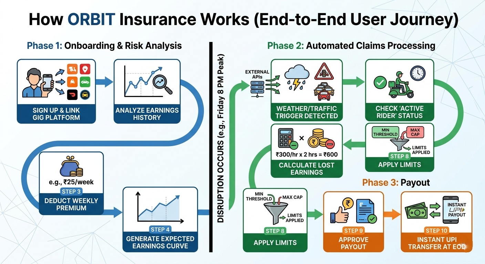
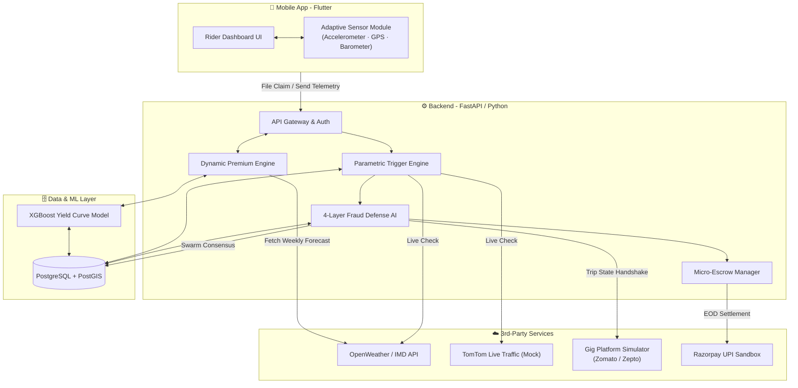

  

<h1 align="center">ORBIT</h1>
<h3 align="center">System Operating Around Riders</h3>
<h4 align="center"><em>Autonomous Earnings Resilience Algorithm</em></h4>

  <strong>"We don't just insure against acts of God; we insure against the realities of the City."</strong>

  
  
  
  
  

  <a href="https://github.com/aswin09032006/ORBIT"><strong>📂 Repository</strong></a> &nbsp;·&nbsp;
  <a href="https://drive.google.com/file/d/16gQw3vn_Ns8G7PlmkEBDciPMOxrnyTEJ/view?usp=sharing"><strong>🎬 Phase 1 Prototype Video</strong></a>

---

## 📋 Table of Contents

1. [Executive Summary](#1--executive-summary)
2. [Persona-Based Scenarios & Application Workflow](#2--persona-based-scenarios--application-workflow)
3. [The Weekly Premium Model & The "Yield Curve"](#3--the-weekly-premium-model--the-yield-curve)
4. [Parametric Triggers Defined](#4--parametric-triggers-defined)
5. [Justification: Web vs. Mobile Platform](#5--justification-web-vs-mobile-platform)
6. [AI/ML Integration & 4-Layer Fraud Defense](#6--aiml-integration--4-layer-fraud-defense-the-hackathon-usp)
7. [Technical Architecture](#7--technical-architecture)
8. [Tech Stack & Development Plan](#8--tech-stack--development-plan)

---

## 1 · Executive Summary

**ORBIT** is an **AI-powered, hybrid parametric insurance platform** built exclusively for India's **Quick-Commerce (Q-Commerce) delivery partners** (riders of Zepto, Blinkit, Swiggy Instamart).

### The Core Mission
Gig workers lack safety nets against **hyper-local, uncontrollable external disruptions**—flash floods, VIP traffic gridlocks, severe smog, and sudden unmapped roadblocks—that steal their working hours. ORBIT provides a **weekly financial safety net** that protects a gig worker's **INCOME** during these events. 

>[!IMPORTANT]
> **Scope of Coverage:** This platform strictly covers **Wage/Income Loss** and explicitly **excludes** health, life, accidents, or vehicle repair coverage.

### The Hybrid Claim Engine
ORBIT operates on a hybrid model. Macro-disruptions (like severe city-wide weather) are **100% automated** with zero touch. However, for unmapped, hyper-local disruptions (like a sudden police barricade), ORBIT features a **Smart Manual Claim** process utilizing a secure, live-geotagged in-app camera to prevent fraud.

---

## 2 · Persona-Based Scenarios & Application Workflow

**Target Persona:** Q-Commerce Delivery Partners (10-minute delivery riders operating in high-density urban zones).

### Scenario A - *The Micro-Gridlock (Parametric Auto-Claim)*
| Stage | Details |
|---|---|
| **Context** | Raju, a Blinkit rider, is trapped in a severe 2km traffic gridlock caused by a sudden political rally. |
| **Action** | Raju opens ORBIT and taps **"File Claim: I am Stuck"**. |
| **Resolution** | The app queries the **TomTom Live Traffic API** validating a severe velocity drop. To prevent GPS spoofing, the app checks his phone's **accelerometer** (verifying micro-vibrations of engine idling) and validates that **4 other insured riders** in his 500m radius are also stationary (**Swarm Consensus**). |
| **Outcome** | The claim is **auto-approved**. The AI calculates his projected earnings for that 90-minute window (₹180) and locks it in his **Micro-Escrow**. At EOD, if the gig platform confirms he didn't secretly complete the delivery, the ₹180 transfers to his UPI. |

### Scenario B - *The Flash Flood (Zero-Touch Parametric)*
| Stage | Details |
|---|---|
| **Context** | A sudden torrential downpour floods Sector 44. |
| **Action** | **Purely parametric**—no rider action required. OpenWeather API pushes a **>15mm/hr** rain alert. |
| **Resolution** | The ORBIT backend **automatically triggers** an income-loss event for all active riders geofenced in Sector 44. |
| **Outcome** | Riders are automatically compensated based on their **AI Yield Curve** for the hours the zone remains red-flagged. |

### Scenario C - *The Unmapped Roadblock (Smart Manual Claim)*
| Stage | Details |
|---|---|
| **Context** | A fallen tree or localized protest completely blocks the delivery route. This event is too small/sudden to appear on TomTom or weather APIs. |
| **Action** | The rider taps **"File Claim: Unmapped Disruption"**. Because external APIs cannot verify this, ORBIT instantly opens a **Secure In-App Camera** (disabling gallery uploads). |
| **Resolution** | The rider captures a **Live Geotagged Photo** of the barricade/tree. The app embeds exact GPS coordinates, timestamp, and device telemetry directly into the image metadata. |
| **Outcome** | Backend Vision AI (or Admin review) validates the proof. The AI Yield Curve calculates the lost time, locking funds into the Micro-Escrow. |

---

## 3 · The Weekly Premium Model & The "Yield Curve"

Gig workers operate on **weekly payout cycles**. Our financial model is strictly aligned with a **Weekly Pricing Cycle**, calculated dynamically every **Sunday** using AI.

### 🧠 The AI Yield Curve

> Standard insurance pays a flat rate. Our ML model analyzes a rider's **historical earnings** to generate an **Expected Earnings Curve** - predicting, for example, that they earn ₹150/hr on Tuesday afternoons but **₹300/hr** on Friday nights. When a disruption occurs, ORBIT pays the **exact area under the curve** for the lost time.

### 💵 Dynamic Weekly Premium Calculation

| Component | Amount | Logic |
|---|---|---|
| **Base Premium** | ₹20 / week | Flat weekly contribution for minimum coverage. |
| **Zone Volatility Risk** | +₹5 | Applied if the rider's primary geofence is historically prone to waterlogging or traffic gridlocks. |
| **Weather Forecast Risk** | +₹3 | Applied if IMD predicts extreme heat or rain for the upcoming week. |
| **Loyalty Adjustment** | −10% | Discount for top-tier, consistently active riders. |
| **Collection** | - | Automatically deducted via **UPI Auto-Pay** mandate every Sunday night. |

---

## 🧭 How ORBIT Insurance Works (End-to-End)

### 👤 Step 1: Rider Joins
- Signs up in the ORBIT app  
- Links:
  - Delivery platform (earnings data)
  - UPI AutoPay  

👉 System learns the rider’s **earning pattern**

---

### 💸 Step 2: Weekly Premium *(What the Rider Pays)*

Every Sunday night → auto deduction

#### 💰 Example Premium Breakdown

| Component | Amount |
|----------|--------|
| Base premium | ₹20 |
| Zone risk (flood/traffic area) | +₹5 |
| Weather risk (rain/heat forecast) | +₹3 |
| Loyalty discount | −₹3 |

👉 **Total Weekly Premium ≈ ₹25**

---

### 🧠 Step 3: AI Builds Earnings Curve

The system predicts how much the rider usually earns:

| Day | Time | Expected Earnings |
|-----|------|------------------|
| Mon | 2–4 PM | ₹120/hr |
| Fri | 7–10 PM | ₹300/hr |
| Sun | Lunch | ₹250/hr |

👉 This becomes the rider’s **income map**

---

### ⚠️ Step 4: Disruption Happens

**Example:**
- Heavy rain in rider’s area  
- Time: **Friday 8–10 PM (peak hours)**  

System detects:
- Weather API trigger  
- Traffic slowdown  
- Rider inactive due to disruption  

---

### 💰 Step 5: Payout *(What the Rider Receives)*

ORBIT calculates **actual income loss** (not fixed payouts)

#### 📊 Example Calculation

- Expected earning: ₹300/hr  
- Lost time: 2 hours  

👉 **Payout = ₹600**

✔ Instantly credited via UPI  

---

## Simple Summary (For Riders)

### You Pay
- Around **₹20–₹30 per week**

### You Receive

| Situation | Outcome |
|----------|--------|
| No disruption | ₹0 (like normal insurance) |
| Disruption occurs | ₹100 – ₹800+ |

Depends on:
- Time of day  
- Duration of disruption  
- Your earning pattern  

---

## Real Weekly Scenarios

### 📉 Week 1 (No Issues)
- Premium paid: ₹25  
- No disruption  

**Payout: ₹0**  
Rider loss: ₹25 (small predictable cost)

---

### 🌧 Week 2 (Disruption Happens)
- Premium paid: ₹28  
- Flood causes 3-hour loss during peak time  

#### Calculation:
- ₹250/hr × 3 hours = ₹750  

**Payout: ₹750**

---

## Why This Feels Fair

✔ Not random payouts  
✔ Based on your actual earnings  
✔ Higher earners → higher protection  
✔ Peak hours → higher compensation  

---

## 🔴 CRITICAL SYSTEM CONDITIONS (Business Guardrails)

To protect ORBIT's business model and liquidity pool, payouts are subject to strict, non-optional smart-contract rules:

1. **Minimum Activity Condition:** Payouts *only trigger* if the rider was actively logged in and delivering for the **last 30–60 minutes** prior to the disruption.

2. **Waiting Period (Anti-Adverse Selection):** Coverage strictly starts **24 hours after premium payment**. This prevents riders from downloading the app and joining right before a forecasted storm.

3. **Cooldown Between Claims:** A mandatory **2-hour gap** is enforced between consecutive payouts for the same rider to prevent chain-triggering.

4. **Multi-Signal Validation:** Payouts *never rely* on 1 signal. We enforce tripartite consensus: **External API Data + Gig Platform `Trip_State` + On-Device Behavioral Telemetry**.

5. **Dynamic Risk Pricing Feedback:** If a rider claims frequently (higher statistical risk), their profile updates and their **next week's premium automatically increases**.

6. **Financial Caps:** Minimum payout threshold = **₹100** (avoids micro-transactions). Max payout cap = **₹2000/week** (protects business from extreme loss).

### The User Journey

---

## 4 · Parametric Triggers Defined

We target specific, **data-backed external parameters** to initiate "Loss of Income" claims:

| Disruption Type | Trigger Parameter *(Data Source)* | Impact on Worker | Payout Logic |
|---|---|---|---|
| **Micro-Gridlocks** | TomTom / Google Maps API showing **>80% velocity drop** in a 1 km grid. | Trapped in traffic; cannot fulfill orders. | AI Yield Curve - exact match for minutes lost. |
| **Extreme Rain** | OpenWeather API records **>15 mm** rain per hour. | App halts orders; riding is unsafe. | AI Yield Curve - match for duration of storm. |
| **Severe Heatwave** | API records localized temperature **>45 °C**. | Dangerous to ride outdoors mid-day. | Lump-sum shift replacement for **1 PM – 4 PM**. |
| **Severe Smog** | AQI API reads **>450** (Severe Plus). | Visibility drops; stamina impacts. | Fixed daily compensation for reduced capacity. |

---

## 5 · Justification: Web vs. Mobile Platform

> **Decision: Mobile Application (Flutter)**

| Criterion | Justification |
|---|---|
| **User Environment** | Gig workers **exclusively use smartphones** for their livelihood. A web application is entirely unsuited for their operational environment. |
| **Technical Necessity** | Our primary AI Fraud Defense - **Adaptive Sensor Fusion** - requires direct **native access** to the smartphone's hardware (Accelerometer, Gyroscope, Barometer) and **background Geolocation** tracking. PWAs and Web platforms **cannot** reliably access background physical sensors or granular location telemetry needed to detect GPS spoofing. |

---

## 6 · AI/ML Integration & 4-Layer Fraud Defense *(The Hackathon USP)*

To completely eliminate **moral hazard** and **fake claims**, ORBIT utilizes a highly novel **4-layer validation architecture** powered by AI:

### Layer 1 - Adaptive Sensor Fusion *(Hardware-Agnostic ML)*

Uses **local device sensors** to prevent GPS spoofing:
- **Barometer** - detects sudden atmospheric pressure drops correlated with storm claims.
- **Accelerometer** - reads physical micro-vibrations (engine idling in traffic).
- **Zero vibrations = Rider is at home spoofing GPS → Claim rejected.**

### Layer 2 - Swarm Consensus *(Proof of Gridlock)*

- PostGIS database groups claimants into **500 m hex-grids**.
- The AI cross-checks the velocity of **other insured riders** in that hex.
- If **one** claims gridlock but **four others** are moving at 40 km/h → **claim is flagged as fraud**.

### Layer 3 - Platform State Handshake *(Anti-Moral Hazard)*

- Simulated API call to the gig platform (Zomato / Zepto).
- Payouts release **only** if `Trip_State` = `"Cancelled"` or `"Delayed"`.
- If `Trip_State` = `"Completed"` (rider found a shortcut & got paid) → **claim auto-aborted** *(Anti-Double Dipping)*.

### Layer 4 - Telemetry Validation

- Post-claim, AI continuously monitors **GPS velocity**.
- Sustained forward movement (20–30 km/h) toward the destination → **payout auto-halted**.

### 🔒 Real-World Threat Response

Just today, the DEVTrails team warned us about Telegram syndicates using GPS spoofers to drain liquidity pools. **Simple GPS is dead — but ORBIT is ready.**

Because we use **hardware-level Sensor Fusion** to detect the *physical micro-vibrations* of a bike, combined with **temporal clustering** to identify coordinated claim spikes, a spoofer sitting on their sofa is instantly flagged.

And if there is a false positive?

Our graceful UX simply asks the rider for a **3-second live video of the disruption**.

👉 The honest worker gets paid.  
🚫 The syndicate gets blocked.  
🛡️ The liquidity pool remains secure.

---

## 7 · Technical Architecture

---

    

---

## 8 · Tech Stack & Development Plan

### 🧰 Tech Stack

| Layer | Technology | Rationale |
|---|---|---|
| **Frontend** | Flutter (Dart) | Cross-platform with native sensor integration and high-performance rendering. |
| **Backend** | Python - FastAPI | High concurrency, native ML library support. |
| **Database** | PostgreSQL + PostGIS | Geo-hashing, geofencing, and Swarm Consensus queries. |
| **AI / ML** | Scikit-learn · XGBoost | Time-series Expected Earnings Yield Curve generation. |
| **Mock Services** | Flask | Simulating Zepto / Zomato `Trip_State` payloads. |
| **Payments** | Razorpay UPI Sandbox | Micro-Escrow settlement loop. |

---

## 🚨 URGENT: Adversarial Defense & Anti-Spoofing Strategy
*(Response to the DEVTrails Phase 1 Critical Threat Report)*

To combat coordinated **Telegram Syndicates** exploiting parametric platforms via advanced GPS spoofing, ORBIT shifts the paradigm from **Location Trust** to **Physical State Verification**. Simple GPS coordinates are easily manipulated; physics is not. 

### 1. The Differentiation: AI vs. The Spoofing Syndicate
A bad actor resting at home with a GPS spoofer has a fundamentally different physical/digital footprint than a genuine rider trapped in a storm. 
*   **The Physics of Disruption:** Our **Adaptive Sensor Fusion AI** analyzes real-time hardware telemetry. A rider in a storm experiences micro-vibrations and atmospheric pressure drops. A spoofer at home outputs a perfectly flat, zero-vibration accelerometer timeline.
*   **The Swarm Anomaly:** If 500 riders suddenly claim they are stuck in Zone A, but our mock Gig Platform API indicates that *non-syndicate* riders are actively completing deliveries in Zone A, our **Swarm Consensus Engine** flags the localized spike as a bot attack and freezes auto-payouts for that geohash.

### 2. The Data: Multi-Dimensional Telemetry (Beyond GPS)
Our ML model evaluates a matrix of data points fake GPS apps cannot simulate:
*   **Micro-Drift (GPS):** Genuine GPS naturally bounces; spoofed GPS is suspiciously static (0.0000 m/s) or snaps to points.
*   **Device Hardware:** Genuine accelerometer shows vehicular jitter; spoofer accelerometer is dead flat, and phone is likely in a "charging state."
*   **Temporal Clustering:** Genuine claims roll in organically; syndicate claims trigger hundreds of times simultaneously milliseconds after a Telegram broadcast.

### 3. The UX Balance: The "Secure Proof of Environment"
What if a genuine rider takes shelter inside a concrete building, causing GPS drift and deadening sensor telemetry? We must not unjustly ban them.
*   **Graceful Degradation (Smart Manual Claim Fallback):** If our ML flags a claim as *Suspicious*, the UI dynamically shifts from "Zero-Touch" to "Verification Mode."
*   **The Action:** The app prompts: *"Telemetry unusual. To unlock your Micro-Escrow, please capture a live photo of the disruption."*
*   **The Security Layer:** The ORBIT app forces the use of a **Secure In-App Camera** that strictly blocks uploads from the phone's gallery (preventing the syndicate from uploading downloaded photos of floods). The captured photo is cryptographically stamped with the live geohash, timestamp, and accelerometer state.
*   **The Result:** The honest rider easily snaps a photo of the flooded street, and the AI Vision model verifies it. The spoofer sitting in their bedroom is instantly defeated. Furthermore, our **Micro-Escrow** prevents the syndicate from instantly draining the liquidity pool.

---

### 🗓️ 6-Week Execution Timeline

#### Phase 1 - Foundation & Strategy *(Current → March 20)*

- [x] Define core architecture, persona logic, and Yield Curve mathematics.
- [x] Draft detailed requirement documentation *(this README)*.
- [x] Create minimal UI/UX flow diagrams for the Q-Commerce persona.
- [x] Record the 2-minute strategy pitch video.

#### Phase 2 - Core Automation & API Mocks *(March 21 → April 4)*

- [ ] **Backend:** Build the AI Yield Curve Logic using a mock CSV dataset of historical gig-worker earnings.
- [ ] **APIs:** Develop the Parametric Trigger Engine integrating OpenWeather API and mocked TomTom Traffic APIs.
- [ ] **Integration:** Build the Mock "Platform State" API for the `Trip_State` Handshake.
- [ ] **Deliverable:** 2-minute demo video - dynamic premium calculation + automated claim trigger.

#### Phase 3 - Deep Tech Fraud Defense & Scaling *(April 5 → April 17)*

- [ ] **Data / ML:** Implement Swarm Consensus logic using PostGIS.
- [ ] **Frontend:** Implement Adaptive Sensor Fusion module in Flutter (Accelerometer data on "File Claim").
- [ ] **Fintech:** Build the Micro-Escrow Razorpay payout loop (Sandbox).
- [ ] **Admin:** Develop a React.js Insurer Dashboard - *Live Disruptions* & *Fraud Attempts*.
- [ ] **Deliverable:** Final 5-minute walkthrough, Final Pitch Deck (PDF), fully documented executable codebase.

---

  <strong>Built with ❤️ for <a href="#">Guidewire DEVTrails 2026</a></strong> 
  ORBIT - Because every rider deserves an orbit of protection.

